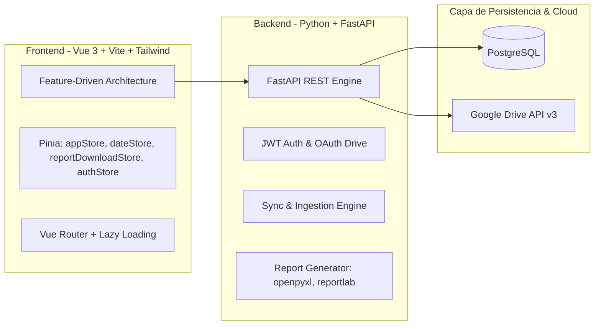

# 🛡️ BIMEH (automPYdrive) — Sistema de Control Operacional y Mapa de Calor del Personal

Sistema integral de analítica operacional, gestión de estado de fuerza, auditoría de novedades y mapas de calor del personal militar y civil del **Batallón de Infantería Mecanizado N.° 12 (BIMEH)**.

Automatiza la ingesta masiva (Excel/JSON y Google Drive), la consolidación cronológica diaria y la exportación de reportes de alta fidelidad (Excel, PDF vectorial y CSV).

---

## 🌟 Características Principales

- **📊 Dashboard Operacional en Tiempo Real:** Visualización de disponibilidad diaria, índice operativo, detección de transiciones de estado (*cambios vs ayer*), evolución temporal y gráficos de distribución con Apache ECharts.
- **🎖️ Expediente Digital del Personal:** Búsqueda predictiva con debounce, hoja de ruta individual, mapas de calor mensual y anual con columna de personal estática/congelada, y cálculo de métricas de permanencia en servicio.
- **📅 Cronología y Bitácora Diaria:** Calendario interactivo con código de color semáforo (operatividad alta/media/baja), tabla del parte diario oficial y matriz mensual de toda la unidad.
- **🔄 Sincronización e Ingesta Flexible:** Carga manual *drag-and-drop* (archivos Excel/JSON), validación de esquemas, detección de conflictos con confirmación de sobrescritura y sincronización automatizada con **Google Drive** vía OAuth2.
- **📑 Centro de Exportación Oficial:** Generación asíncrona de reportes consolidados mensuales, resúmenes anuales y expedientes individuales en formatos Excel con comentarios, PDF de alta fidelidad y CSV con codificación UTF-8-BOM.
- **🔐 Seguridad y Control de Acceso:** Autenticación basada en JWT con expiración configurable, almacenamiento seguro y verificación obligatoria de vinculación con Google Drive.
- **📱 Multiplataforma (Web, Desktop & Mobile):** Interfaz responsive táctica optimizada para navegadores web, empaquetada para escritorio con **Electron** y preparada para móviles con **Capacitor (Android)**.

---

## 🏗️ Arquitectura del Sistema

El proyecto está diseñado bajo una arquitectura desacoplada y modular:



### 1. Frontend (`frontend/`)
Desarrollado con **Vue 3 (Composition API + `<script setup>`)**, **TypeScript**, **Vite**, **Tailwind CSS**, **Pinia** y **Apache ECharts**.
- **Arquitectura Híbrida por *Features*:**
  - `src/features/auth/`: Control de acceso, login y enlace OAuth.
  - `src/features/dashboard/`: KPIs, transiciones de estado y gráficos de evolución.
  - `src/features/personal/`: Buscador, perfiles individuales, líneas de tiempo y mapas de calor.
  - `src/features/cronologia/`: Calendario de actividad diaria, métricas mensuales y matriz de la unidad.
  - `src/features/sincronizar/`: Carga de archivos, selección multi-día y barra de progreso Drive.
  - `src/features/reportes/`: Formularios de descarga y exportación directa.
  - `src/features/estadisticas/`: Rankings globales de novedades y personal.
- **Capas Compartidas Transversales:**
  - `src/components/layout/` (Navbar, Sidebar, Footer) y `src/components/modals/` (ExportModal, ReportGenerationModal).
  - `src/composables/` (`useECharts`, `usePagination`, `useTouchSwipe`).
  - `src/services/` (`http.ts` - Cliente centralizado con token handling y fachada `api.ts`).
  - `src/stores/` (`dateStore`, `appStore`, `reportDownloadStore`, `authStore`).
  - `src/utils/` (`date.ts`, `personal.utils.ts`, `logFormatter.ts`).

### 2. Backend (`backend/`)
Desarrollado en **Python 3** con **FastAPI**, **SQLAlchemy** y motor de exportación estructurado:
- `backend/app/main.py`: Inicialización de FastAPI, configuración de CORS y montaje de routers.
- `backend/app/routers/`:
  - `auth.py`: Login JWT, verificación de sesión y estado OAuth de Drive.
  - `dashboard.py`: KPIs, cambios de estado y evolución temporal.
  - `personal.py`: Búsqueda predictiva, expediente, historial y acumulados.
  - `stats.py`: Rankings globales y mapas de calor.
  - `reportes.py`: Calendario operacional y partes diarios.
  - `sincronizar.py`: Ingesta manual, conexión OAuth y descarga de plantillas oficiales.
  - `exportar.py`: Generación de reportes en Excel, PDF y CSV.
  - `fechas.py`: Catálogo de fechas con datos disponibles.

---

## 🚀 Inicio Rápido en Desarrollo Local

### Requisitos Previos
- **Python 3.10+**
- **Node.js 18+** y **npm**
- **PostgreSQL 14+**

---

### 1. Configuración del Backend

1. Crear y activar el entorno virtual en la raíz del proyecto:
   ```bash
   python -m venv .venv
   # Windows:
   .\.venv\Scripts\activate
   # Linux/macOS:
   source .venv/bin/activate
   ```

2. Instalar dependencias del backend:
   ```bash
   pip install -r backend/requirements.txt
   ```

3. Iniciar el servidor FastAPI:
   ```bash
   cd backend
   uvicorn app.main:app --host 127.0.0.1 --port 8000 --reload
   ```
   *La API estará disponible en `http://127.0.0.1:8000` (Documentación Swagger interactiva en `http://127.0.0.1:8000/docs`).*

---

### 2. Configuración del Frontend

1. Navegar al directorio del frontend e instalar paquetes:
   ```bash
   cd frontend
   npm install
   ```

2. Iniciar el servidor de desarrollo:
   ```bash
   npm run dev
   ```
   *La aplicación web se ejecutará en `http://localhost:5173`.*

3. Compilar para producción:
   ```bash
   npm run build
   ```

---

## 📚 Documentación Técnica Detallada

El proyecto cuenta con un sistema completo de documentación técnica y funcional:

- 🏛️ **[Arquitectura Modular del Frontend & Tree Map](file:///c:/Users/alejo/Downloads/automPYdrive/documentacion/frontend_architecture.md):** Explicación de diseño, estructura de carpetas, principios de ingeniería y catálogo exhaustivo de archivos frontend.
- 🗺️ **[Documentación Modular de Negocio](file:///c:/Users/alejo/Downloads/automPYdrive/documentacion/README.md):** Historias de usuario, reglas de negocio y casos de uso por cada módulo funcional (`auth`, `dashboard`, `personal`, `cronologia`, `sincronizar`, `reportes`, `estadisticas`).
- 💻 **[Guía de Integración Electron Desktop](file:///c:/Users/alejo/Downloads/automPYdrive/docs/electron_setup.md):** Empaquetado como ejecutable `.exe` de escritorio.
- 📖 **[Manual Técnico del Sistema](file:///c:/Users/alejo/Downloads/automPYdrive/docs/manual_tecnico.md):** Arquitectura backend, modelo relacional de PostgreSQL e infraestructura.
- 👤 **[Manual de Usuario](file:///c:/Users/alejo/Downloads/automPYdrive/docs/manual_usuario.md):** Guía de uso operativo paso a paso.

---

## 🛡️ Licencia y Confidencialidad

Sistema de uso exclusivo para el **Batallón de Infantería Mecanizado N.° 12 (BIMEH)**. Prohibida su reproducción, distribución o uso no autorizado.
