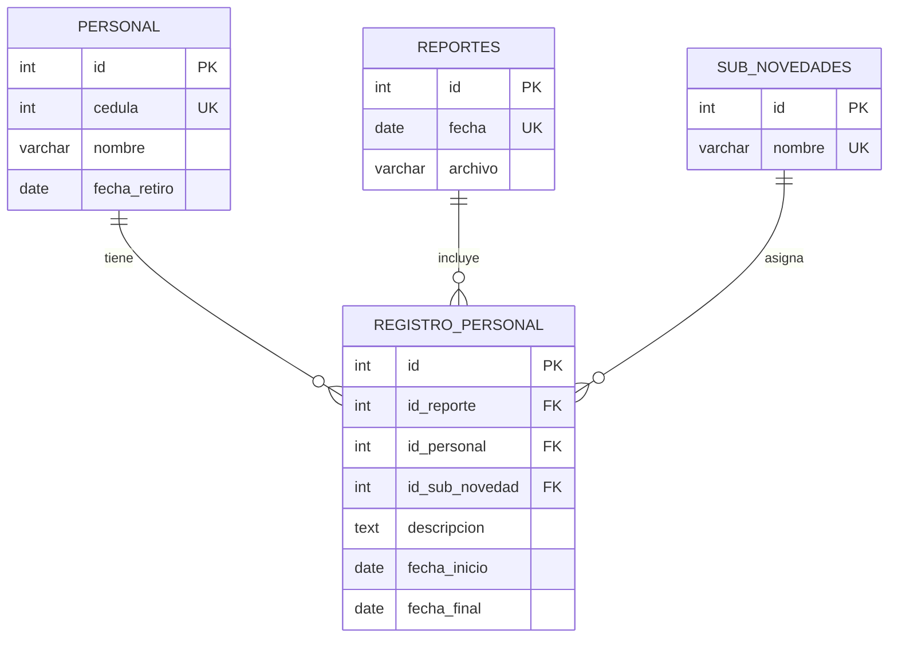

# MANUAL TÉCNICO
## BIMEH: Sistema de Control Operacional y Disponibilidad de Personal

---

## 1. Portada
* **Nombre del sistema**: BIMEH (Gestión y Mapa de Calor del Personal)
* **Versión**: 2.1
* **Documento**: Manual Técnico para Administradores de Sistemas y Desarrolladores
* **Autor**: Equipo de Desarrollo BIMEH (Pair Programming con Antigravity)
* **Fecha**: Julio de 2026

---

## 2. Introducción

### Objetivo
Este documento sirve como guía para el despliegue, configuración, mantenimiento y extensión del sistema BIMEH. Su objetivo es brindar a los administradores de sistemas y desarrolladores una visión clara de la arquitectura, diseño de base de datos, dependencias y procesos de instalación.

### Arquitectura General
BIMEH está diseñado bajo un modelo de arquitectura desacoplada de dos capas principales (Frontend y Backend) conectadas por una API REST, con persistencia relacional en base de datos PostgreSQL:

```
        ┌──────────────────────────────────────┐
        │        Usuario (Navegador)           │
        └──────────────────┬───────────────────┘
                           │
                           ▼ (HTTP / JSON)
        ┌──────────────────────────────────────┐
        │        Frontend SPA (Vue 3)          │
        └──────────────────┬───────────────────┘
                           │
                           ▼ (Axios REST Requests)
        ┌──────────────────────────────────────┐
        │       Backend API (FastAPI)          │
        └──────────────────┬───────────────────┘
                           │
                           ▼ (SQL / Psycopg2)
        ┌──────────────────────────────────────┐
        │     Base de Datos (PostgreSQL)       │
        └──────────────────────────────────────┘
```

### Tecnologías Utilizadas
* **Backend**: Python 3.12, FastAPI, Uvicorn, psycopg2.
* **Frontend**: Vue 3 (Composition API), Vite, TypeScript, Tailwind CSS, Pinia, Vue Router, ECharts.
* **Almacenamiento**: PostgreSQL 15.
* **Librerías de Reportes**: ReportLab (generación nativa de PDFs) y OpenPyXL (manipulación de archivos Excel).

---

## 3. Arquitectura del Sistema y Flujo de Datos

1. **Capa Cliente (Frontend)**: Construido como una aplicación de página única (SPA). Consume la API mediante llamadas asíncronas y renderiza dashboards visuales.
2. **Capa Servidor (Backend)**: Expone endpoints RESTful. Se encarga de procesar la lógica de negocio, calcular las agregaciones y generar dinámicamente los archivos CSV, Excel y PDF.
3. **Capa de Persistencia (Base de Datos)**: Base de datos relacional para indexar eficientemente los reportes diarios e integrantes.

---

## 4. Tecnologías y Versiones Requeridas

* **Python**: `3.12.x`
* **FastAPI**: `0.111.x` o superior
* **Uvicorn**: `0.30.x`
* **PostgreSQL**: `15.x` o superior
* **Node.js**: `18.x` o superior
* **npm**: `9.x` o superior

---

## 5. Estructura del Proyecto

### Backend
Ubicado en la raíz del proyecto, el backend modularizado se organiza de la siguiente manera:
```
app/
│
├── main.py            # Inicialización de FastAPI y Middlewares de CORS.
├── database.py        # Configuración del pool de conexiones a PostgreSQL y adaptadores.
├── dependencies.py    # Dependencias comunes de FastAPI (inyección de sesiones de DB).
├── models.py          # Definiciones de modelos y clases de datos de Python.
│
└── routers/           # Enrutadores modulares de la API REST:
    ├── dashboard.py   # Consultas de estado de fuerza diario y novedades del Dashboard.
    ├── personal.py    # Rutas para perfiles, buscador e historiales individuales.
    ├── stats.py       # Cálculos agregados e índices acumulados históricos.
    ├── alertas.py     # Alertas operacionales diarias.
    ├── exportar.py    # Lógica de renderizado y exportación de archivos (Excel, CSV, PDF).
    └── sincronizar.py # Carga, validación de columnas y sobreescritura de reportes Excel/JSON.
```

### Frontend
Localizado dentro del directorio `frontend/`:
```
frontend/
│
├── index.html         # Archivo raíz HTML.
├── vite.config.ts     # Configuración de compilación de Vite.
├── package.json       # Dependencias de npm y scripts de ejecución.
│
└── src/
    ├── main.ts        # Punto de inicio del cliente TypeScript.
    ├── App.vue        # Componente raíz de la interfaz.
    │
    ├── assets/        # Estilos CSS globales de Tailwind.
    ├── router/        # Definición de rutas de navegación (Vue Router).
    ├── stores/        # Almacén de estados globales (Pinia - appStore.ts).
    ├── types/         # Interfaces de datos compartidas (TypeScript - index.ts).
    ├── services/      # Cliente centralizado de comunicación con la API (api.ts).
    │
    └── views/         # Componentes Single File (SFC) de vistas principales:
        ├── DashboardView.vue
        ├── CronologiaView.vue
        ├── EstadisticasView.vue
        ├── ReportesView.vue
        ├── PersonalView.vue
        ├── PersonalDetalleView.vue
        └── SincronizarView.vue
```

---

## 6. Base de Datos y Modelo Entidad-Relación

El sistema utiliza un esquema normalizado compuesto por cuatro tablas principales:



### Diccionario de Datos

#### Tabla: `PERSONAL`
Registra a los integrantes de la unidad.
* `id` (INTEGER, SERIAL PK): Identificador único interno.
* `cedula` (INTEGER, UNIQUE): Cédula de identidad. Usado como identificador de negocio.
* `nombre` (VARCHAR): Nombre completo (apellidos y nombres).
* `fecha_retiro` (DATE, NULLABLE): Fecha de desvinculación de la unidad.

#### Tabla: `SUB_NOVEDADES`
Catálogo de estados y novedades operacionales del personal.
* `id` (INTEGER, SERIAL PK): Identificador único.
* `nombre` (VARCHAR, UNIQUE): Nombre de la subnovedad (ej. `"CDO UNIDAD"`, `"VACACIONES"`, `"PERMISO"`).

#### Tabla: `REPORTES`
Lleva el control de las fechas operacionales registradas en el sistema.
* `id` (INTEGER, SERIAL PK): Identificador único.
* `fecha` (DATE, UNIQUE): Fecha del día reportado.
* `archivo` (VARCHAR): Nombre del archivo fuente procesado.

#### Tabla: `REGISTRO_PERSONAL`
Asocia un integrante a un reporte de novedades y a una subnovedad específica.
* `id` (INTEGER, SERIAL PK): Identificador del registro.
* `id_reporte` (INTEGER, FOREIGN KEY REFERENCES `REPORTES(id)`): ID del reporte diario.
* `id_personal` (INTEGER, FOREIGN KEY REFERENCES `PERSONAL(id)`): ID del integrante.
* `id_sub_novedad` (INTEGER, FOREIGN KEY REFERENCES `SUB_NOVEDADES(id)`): ID de la subnovedad.
* `descripcion` (TEXT, NULLABLE): Justificación o descripción adicional.
* `fecha_inicio` (DATE, NULLABLE): Vigencia inicial de la novedad.
* `fecha_final` (DATE, NULLABLE): Vigencia final de la novedad.

---

## 7. Configuración e Instalación

### Variables de Configuración
La conexión con la base de datos PostgreSQL se define en el archivo [`config.py`](file:///c:/Users/alejo/Downloads/automPYdrive/config.py):
```python
DB_CONFIG = {
    "dbname": "bimeh",
    "user": "postgres",
    "password": "postgres",
    "host": "localhost",
    "port": "5432"
}
```

### Paso a Paso para Despliegue Local

#### 1. Preparar la Base de Datos
Cree la base de datos en su servidor PostgreSQL:
```sql
CREATE DATABASE bimeh;
```

#### 2. Instalar y Levantar el Servidor Backend
Navegue a la raíz del directorio del proyecto:
```bash
# Crear entorno virtual de Python
python -m venv .venv

# Activar el entorno virtual
# En Windows:
.venv\Scripts\activate
# En Linux/macOS:
source .venv/bin/activate

# Instalar dependencias
pip install -r requirements.txt

# Inicializar y poblar la base de datos con los históricos existentes
python crear_y_poblar_db.py

# Iniciar la API REST
uvicorn app.main:app --host 127.0.0.1 --port 8000 --reload
```

#### 3. Instalar y Levantar el Cliente Frontend
Abra una nueva terminal en el directorio `frontend/`:
```bash
cd frontend
npm install
npm run dev
```

---

## 8. Mantenimiento y Respaldos

### Crear un Respaldo de Base de Datos
Para respaldar la información histórica de la base de datos, ejecute en la terminal de PostgreSQL:
```bash
pg_dump -U postgres -d bimeh -F c -b -v -f bimeh_respaldo.backup
```

### Restaurar Base de Datos
Para restaurar un backup previamente creado:
```bash
pg_restore -U postgres -d bimeh -v bimeh_respaldo.backup
```

### Revisión de Logs
Los logs de la API se emiten de manera directa en la salida estándar de la consola donde corre `uvicorn`. Se recomienda redirigir la salida en entornos de producción:
```bash
uvicorn app.main:app --host 0.0.0.0 --port 8000 > backend.log 2>&1 &
```

---

## 9. Seguridad y Validaciones

* **CORS (Cross-Origin Resource Sharing)**: El backend restringe los accesos únicamente a los dominios permitidos declarados en [`app/main.py`](file:///c:/Users/alejo/Downloads/automPYdrive/app/main.py).
* **Validación de Tipos**: Las rutas del servidor y el cliente web están fuertemente validadas y tipadas mediante esquemas e interfaces de TypeScript en frontend y tipos nativos en el backend.
* **Integridad Referencial**: Base de datos protegida mediante llaves foráneas (`FOREIGN KEY`) y restricciones de unicidad (`UNIQUE`) en los campos clave como la cédula del personal y la fecha de reportes.

---

## 10. Solución de Problemas Frecuentes

### "Error al conectar con PostgreSQL"
* **Causa**: El puerto `5432` está bloqueado o el servicio de PostgreSQL está detenido.
* **Solución**: Verifique el estado del servicio mediante `services.msc` en Windows o ejecute `sudo systemctl status postgresql` en Linux.

### "Error CORS en el navegador al solicitar descargas"
* **Causa**: La URL del frontend no está agregada en la lista de orígenes permitidos en el backend.
* **Solución**: Revise y agregue la dirección correcta en la directiva `CORSMiddleware` dentro de [`app/main.py`](file:///c:/Users/alejo/Downloads/automPYdrive/app/main.py).

---

## 11. Anexos: Documentación de Endpoints API REST

| Método | Endpoint | Descripción | Parámetros Clave |
| :--- | :--- | :--- | :--- |
| **GET** | `/api/dashboard/kpis` | Retorna los totales del estado de fuerza diario. | `fecha` (YYYY-MM-DD) |
| **GET** | `/api/dashboard/evolucion` | Retorna la fluctuación de disponibles en el mes. | `mes` (Nombre del mes) |
| **GET** | `/api/personal/search` | Búsqueda predictiva de integrantes del personal. | `query` (Nombre o cédula) |
| **GET** | `/api/personal/detalle/{cedula}` | Retorna la ficha básica del integrante. | `cedula` |
| **GET** | `/api/personal/historial/{cedula}`| Retorna la lista completa de novedades del usuario. | `cedula` |
| **GET** | `/api/personal/acumulado/{cedula}`| Retorna los acumulados en días por subnovedad. | `cedula` |
| **GET** | `/api/exportar/excel` | Descarga de reportes en Excel. | `tipo`, `fecha`, `mes`, `cedula`, `subnovedad` |
| **GET** | `/api/exportar/pdf` | Descarga de reportes en PDF vectoriales. | `tipo`, `fecha`, `mes`, `cedula`, `subnovedad` |
| **GET** | `/api/exportar/csv` | Descarga de reportes en CSV. | `tipo`, `fecha`, `mes`, `cedula`, `subnovedad` |
| **GET** | `/api/sincronizar/plantilla/{format}` | Descarga de plantilla Excel o JSON para carga. | `format` (excel / json) |
| **POST** | `/api/sincronizar/cargar` | Carga de reportes Excel/JSON y sincronización. | `tipo`, `fecha`, `mes`, `overwrite`, `file` |
