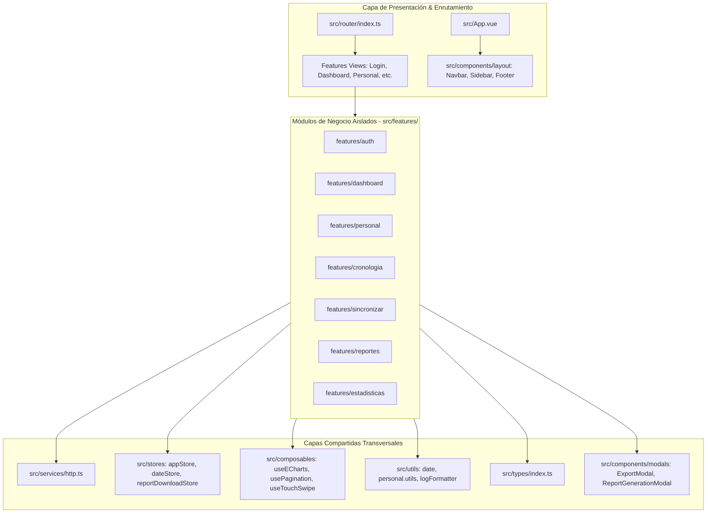

# 🏛️ Arquitectura Modular del Frontend: BIMEH (automPYdrive)

Documento oficial de arquitectura técnica, principios de diseño, organización por funcionalidades (*Feature-Driven Architecture*) y *Tree Map* exhaustivo del frontend de **BIMEH (automPYdrive)**.

---

## 1. Visión General de la Arquitectura Híbrida

El frontend está estructurado bajo una **Arquitectura Híbrida: *Feature Folders* + Capas Compartidas Transversales**. 

Este patrón resuelve las limitaciones de la arquitectura tradicional basada únicamente en tipos técnicos (`views/`, `components/`, `services/`), en la cual los artefactos de un mismo dominio de negocio terminaban dispersos en múltiples directorios distantes.



---

## 2. Explicación de Carpetas y Decisiones de Diseño

### 2.1. `src/features/<modulo>/` (Módulos de Dominio)
* **Propósito:** Agrupa todo el código relacionado con un caso de uso o dominio de negocio específico (`auth`, `dashboard`, `personal`, `cronologia`, `sincronizar`, `reportes`, `estadisticas`).
* **Sub-estructura por Feature:**
  - `components/`: Componentes de presentación exclusivos del módulo (ej. `DashboardKpis.vue`, `PersonalTimeline.vue`).
  - `composables/`: Lógica reactiva de orquestación propia del módulo (ej. `useDashboardData.ts`, `usePersonalProfile.ts`).
  - `services/`: Peticiones HTTP especializadas al backend (ej. `dashboard.service.ts`, `personal.service.ts`).
  - `stores/`: Estado local del módulo si lo requiere (ej. `authStore.ts`).
  - `views/`: Vista principal o páginas que se montan en el Router (ej. `DashboardView.vue`, `PersonalDetalleView.vue`).
* **¿Por qué es una buena práctica?**
  - **Alta Cohesión:** Modificar una vista (ej. agregar un filtro en el Dashboard) se hace en un único directorio sin tener que saltar entre carpetas en extremos opuestos del proyecto.
  - **Bajo Acoplamiento (*Isolation*):** Las features son autónomas y **nunca deben importarse directamente entre sí**.
  - **Eliminación Segura de Código:** Eliminar o reemplazar un módulo completo solo requiere borrar su carpeta sin dejar componentes o composables huérfanos.

### 2.2. `src/components/` (Componentes Compartidos)
* **Propósito:** Aloja exclusivamente componentes reutilizables a nivel global o estructural.
  - `layout/`: Estructura base de la aplicación (`Navbar.vue`, `Sidebar.vue`, `Footer.vue`).
  - `modals/`: Modales globales reutilizados transversalmente (`ExportModal.vue`, `ReportGenerationModal.vue`).
* **¿Por qué es una buena práctica?** Evita duplicar interfaces y centraliza el diseño base del sistema militar.

### 2.3. `src/composables/` (Lógica Reactiva Reutilizable)
* **Propósito:** Funciones de composición reactiva (*Composition API*) puramente utilitarias e independientes de cualquier modelo de datos particular (`useECharts.ts`, `usePagination.ts`, `useTouchSwipe.ts`).
* **¿Por qué es una buena práctica?** Permite que cualquier módulo dibuje gráficos, pagine arrays o maneje gestos táctiles con cero duplicación de código.

### 2.4. `src/stores/` (Estado Global de la Aplicación)
* **Propósito:** Estados compartidos por toda la aplicación Pinia:
  - `dateStore.ts`: Gestión centralizada de fechas, cálculo de meses operacionales activos y sincronización temporal global.
  - `appStore.ts`: URL base de la API, estado del proceso SSE de sincronización Drive en segundo plano, registros de terminal.
  - `reportDownloadStore.ts`: Estado reactivo y control de descargas asíncronas de archivos pesados con modal de progreso.
* **¿Por qué es una buena práctica?** Evita *prop drilling* en árboles profundos y asegura que cuando el usuario cambia el mes en el Navbar, todas las vistas se enteren de manera reactiva e instantánea.

### 2.5. `src/services/` (Capa de Comunicación de Red)
* **Propósito:**
  - `http.ts`: Cliente HTTP centralizado (`fetchWithAuth`, `http.get`, `http.post`) con manejo automático de tokens JWT en `localStorage`, inyección de encabezados `Authorization: Bearer` y redirección a `/login` ante códigos `401 Unauthorized`.
  - `api.ts`: Fachada unificada que re-exporta los servicios especializados manteniendo compatibilidad hacia atrás.
* **¿Por qué es una buena práctica?** Centraliza el tratamiento de errores, interceptores de autenticación y previene inconsistencias en las llamadas de red.

### 2.6. `src/utils/` (Funciones Puras y Formateadores)
* **Propósito:** Utilidades sin estado ni reactividad:
  - `date.ts`: Mapeo de meses en español, cálculo de días bisiestos y rangos.
  - `personal.utils.ts`: Determina si un estado es "Disponible" (`DISPONIBLE`, `CDO UNIDAD`, etc.) y badges de Tailwind.
  - `logFormatter.ts`: Exportación de bitácoras de depuración a texto plano.
* **¿Por qué es una buena práctica?** Las funciones puras son 100% deterministas, fáciles de probar con pruebas unitarias y no producen efectos secundarios.

### 2.7. `src/types/` (Tipos e Interfaces TypeScript)
* **Propósito:** Declaración de modelos de datos, DTOs de respuesta de la API y tipos compartidos (`index.ts`).
* **¿Por qué es una buena práctica?** Garantiza tipado estático estricto (*Type Safety*) en tiempo de compilación con `vue-tsc`, eliminando errores de tiempo de ejecución.

### 2.8. `src/router/` (Enrutador Centralizado)
* **Propósito:** Define las rutas de la SPA con *Code Splitting* dinámico (`import('@features/...')`), títulos dinámicos y *Navigation Guards* para proteger vistas autenticadas.
* **¿Por qué es una buena práctica?** Carga únicamente el código JavaScript de la vista que el usuario está consultando, logrando una carga inicial en menos de 300ms.

---

## 3. Principios de Ingeniería de Software Aplicados

1. **Principio de Responsabilidad Única (SRP):** Cada archivo tiene un único motivo para cambiar.
2. **Contextos Delimitados (*Bounded Contexts - DDD*):** Cada funcionalidad del sistema militar encapsula sus reglas de presentación y consumo de datos.
3. **Inversión de Dependencias (DIP):** Las vistas consumen composables y servicios abstractos en lugar de hacer llamadas fetch directas.
4. **DRY (*Don't Repeat Yourself*):** Reutilización transversal de gráficos (`useECharts`), paginadores (`usePagination`) y formatos de fecha (`utils/date.ts`).

---

## 4. Tree Map Exhaustivo del Frontend

A continuación se detalla la ruta de cada archivo dentro de [`frontend/src/`](file:///c:/Users/alejo/Downloads/automPYdrive/frontend/src), su responsabilidad y enlace directo:

```text
frontend/src/
│
├── 📄 App.vue                           # Componente raíz con layout dinámico (Auth vs Dashboard)
├── 📄 main.ts                          # Punto de entrada de la aplicación Vue 3 y montaje de Pinia/Router
│
├── 📂 assets/
│   └── 📄 main.css                     # Estilos globales de Tailwind CSS, scrollbars y temas glassmorphism
│
├── 📂 components/                       # COMPONENTES COMPARTIDOS
│   ├── 📂 layout/
│   │   ├── 📄 Navbar.vue               # Barra superior con selectores de mes/día, estado Drive y usuario
│   │   ├── 📄 Sidebar.vue              # Menú lateral táctico con navegación e indicadores de versión
│   │   └── 📄 Footer.vue               # Pie de página con créditos, estado de red y atajos
│   └── 📂 modals/
│       ├── 📄 ExportModal.vue          # Modal de exportación rápida de reportes por mes y filtros
│       └── 📄 ReportGenerationModal.vue# Modal de progreso para descargas de archivos con streaming
│
├── 📂 composables/                      # COMPOSABLES COMPARTIDOS
│   ├── 📄 useECharts.ts                # Inicialización reactiva, temas y auto-resize de Apache ECharts
│   ├── 📄 usePagination.ts             # Paginación matemática genérica reutilizable
│   └── 📄 useTouchSwipe.ts             # Detección de gestos táctiles swipe para cambio de pestañas
│
├── 📂 features/                         # MÓDULOS POR DOMINIO
│   │
│   ├── 📂 auth/                        # DOMINIO: Autenticación y Acceso
│   │   ├── 📂 services/
│   │   │   └── 📄 auth.service.ts      # Llamadas a /api/auth/login, /me, drive-status, oauth
│   │   ├── 📂 stores/
│   │   │   └── 📄 authStore.ts         # Estado de sesión JWT, usuario logueado y expiración 24h
│   │   └── 📂 views/
│   │       └── 📄 LoginView.vue        # Pantalla de inicio de sesión y vinculación OAuth Drive
│   │
│   ├── 📂 dashboard/                   # DOMINIO: Dashboard Operacional
│   │   ├── 📂 components/
│   │   │   ├── 📄 DashboardKpis.vue    # Tarjetas KPI de Efectivo Total, Disponibles, Novedades e Índice
│   │   │   ├── 📄 DashboardEvolutionChart.vue # Gráfico de evolución temporal de disponibilidad
│   │   │   ├── 📄 DashboardNovedadesChart.vue # Gráfico de barras de novedades más frecuentes
│   │   │   ├── 📄 DashboardDistribucionChart.vue # Gráfico de dona con distribución de personal por estado
│   │   │   └── 📄 DashboardCambiosList.vue # Lista interactiva de transiciones (Entraron/Volvieron a servicio)
│   │   ├── 📂 composables/
│   │   │   └── 📄 useDashboardData.ts  # Carga concurrente de KPIs y transiciones
│   │   ├── 📂 services/
│   │   │   └── 📄 dashboard.service.ts # Endpoints /api/dashboard/kpis, /cambios, /evolucion, /distribucion
│   │   └── 📂 views/
│   │       └── 📄 DashboardView.vue    # Vista principal orquestadora del dashboard
│   │
│   ├── 📂 personal/                    # DOMINIO: Gestión y Expedientes de Personal
│   │   ├── 📂 components/
│   │   │   ├── 📄 PersonalHeaderCard.vue # Tarjeta principal con datos del militar, estado y botón de reporte
│   │   │   ├── 📄 PersonalKpiGrid.vue   # Métricas individuales de disponibilidad y duración de novedades
│   │   │   ├── 📄 PersonalNovedadesChart.vue # Gráfico polar/rosa de novedades acumuladas del integrante
│   │   │   ├── 📄 PersonalTimeline.vue  # Línea de tiempo cronológica con filtros de subnovedad y fechas
│   │   │   └── 📄 PersonalHeatmapMatrix.vue # Matriz Heatmap individual (Mensual, Anual y Tabla detallada)
│   │   ├── 📂 composables/
│   │   │   ├── 📄 usePersonalProfile.ts # Carga de datos de detalle y cálculo de meses activos
│   │   │   ├── 📄 usePersonalTimelineFilters.ts # Filtros dinámicos de mes, día y subnovedades para la línea de tiempo
│   │   │   └── 📄 usePersonalAutocomplete.ts # Búsqueda con debounce para cédula o apellidos
│   │   ├── 📂 services/
│   │   │   └── 📄 personal.service.ts  # Endpoints /api/personal/buscar, /{cedula}, /historial, /acumulado
│   │   └── 📂 views/
│   │       ├── 📄 PersonalView.vue     # Buscador interactivo (cuadrícula de tarjetas o tabla)
│   │       └── 📄 PersonalDetalleView.vue # Vista de expediente militar completo
│   │
│   ├── 📂 cronologia/                  # DOMINIO: Bitácora Diaria y Calendario
│   │   ├── 📂 components/
│   │   │   ├── 📄 CronologiaActivityCalendar.vue # Calendario mensual con códigos de color de operatividad
│   │   │   ├── 📄 CronologiaMonthlyMetrics.vue # Métricas del mes (promedios, días con mayor y menor disponibilidad)
│   │   │   ├── 📄 CronologiaDailyReportTable.vue # Tabla con el parte oficial de personal del día seleccionado
│   │   │   └── 📄 CronologiaMonthlyHeatmapMatrix.vue # Matriz de toda la unidad con columna de nombres congelada
│   │   ├── 📂 composables/
│   │   │   └── 📄 useCronologiaData.ts # Orquestación de datos de calendario, reporte diario y heatmap mensual
│   │   ├── 📂 services/
│   │   │   └── 📄 cronologia.service.ts# Endpoints /api/reportes/calendario, /dia, /api/stats/heatmap
│   │   └── 📂 views/
│   │       └── 📄 CronologiaView.vue   # Vista de bitácora y conmutador reporte/matriz
│   │
│   ├── 📂 sincronizar/                 # DOMINIO: Ingesta y Sincronización
│   │   ├── 📂 components/
│   │   │   ├── 📄 SyncTemplateDownload.vue # Descarga de plantillas oficiales Excel y JSON
│   │   │   ├── 📄 SyncSourceSelector.vue # Selector de origen (Local / Google Drive) y modo (Días / Mes)
│   │   │   ├── 📄 SyncMultiDayCalendar.vue # Calendario multi-selección de días operativos
│   │   │   ├── 📄 SyncFileDropzone.vue # Zona Drag-and-Drop para arrastrar archivos con validación
│   │   │   ├── 📄 SyncConflictAlert.vue# Banner táctico para resolución y confirmación de sobrescritura
│   │   │   └── 📄 SyncDriveProgress.vue # Barra de progreso en tiempo real para sincronización Drive
│   │   ├── 📂 composables/
│   │   │   ├── 📄 useMultiDaySelection.ts # Lógica para marcar/desmarcar días en calendario
│   │   │   └── 📄 useLocalFileUpload.ts # Manejo de carga de archivos FormData y conflictos
│   │   ├── 📂 services/
│   │   │   └── 📄 sync.service.ts      # Endpoint /api/sincronizar/cargar
│   │   └── 📂 views/
│   │       └── 📄 SincronizarView.vue  # Vista principal de sincronización e ingesta
│   │
│   ├── 📂 reportes/                    # DOMINIO: Centro de Exportación
│   │   ├── 📂 components/
│   │   │   ├── 📄 ReportDirectDownloadCard.vue # Descarga directa en un clic del mes activo (Excel/PDF)
│   │   │   ├── 📄 ReportConsolidadoMensualForm.vue # Formulario para consolidado mensual
│   │   │   ├── 📄 ReportResumenAnualForm.vue # Formulario para resumen anual acumulado
│   │   │   └── 📄 ReportIndividualExpedienteForm.vue # Formulario para exportar expediente por cédula
│   │   ├── 📂 services/
│   │   │   └── 📄 reportes.service.ts  # Construcción de URLs de exportación con parámetros
│   │   └── 📂 views/
│   │       └── 📄 ReportesView.vue     # Panel de generación de informes
│   │
│   └── 📂 estadisticas/                # DOMINIO: Análisis y Rankings
│       ├── 📂 services/
│       │   └── 📄 estadisticas.service.ts # Endpoint /api/stats/ranking
│       └── 📂 views/
│           └── 📄 EstadisticasView.vue # Vista de rankings de novedades y miembros destacados
│
├── 📂 router/
│   └── 📄 index.ts                     # Configuración de Vue Router con lazy loading por feature y auth guard
│
├── 📂 services/
│   ├── 📄 http.ts                      # Cliente HTTP centralizado con interceptor de auth y token handling
│   └── 📄 api.ts                       # Fachada de compatibilidad unificada
│
├── 📂 stores/                           # ESTADO GLOBAL PINIA
│   ├── 📄 appStore.ts                  # Estado general de la app, SSE y sincronización Drive en segundo plano
│   ├── 📄 dateStore.ts                 # Store global de fechas operacionales, selector de mes y meses activos
│   ├── 📄 reportDownloadStore.ts       # Control de descargas asíncronas de archivos con feedback visual
│   └── 📄 authStore.ts                 # Puente de re-exportación de authStore
│
├── 📂 types/
│   └── 📄 index.ts                     # Definiciones e interfaces globales de TypeScript
│
└── 📂 utils/                            # FUNCIONES PURAS
    ├── 📄 date.ts                      # Conversión y manipulación de fechas en español
    ├── 📄 personal.utils.ts            # Clasificación de estados militares y badges visuales
    └── 📄 logFormatter.ts              # Formateador de logs de depuración para descarga .txt
```

---

## 5. Guía para Agregar Nuevas Funcionalidades o Archivos

Cuando necesites agregar una nueva pantalla o funcionalidad al frontend:

1. **Identificar si pertenece a una Feature existente o a una nueva:**
   - Si pertenece a un módulo existente (ej. una nueva gráfica en el Dashboard), crea el componente en `src/features/dashboard/components/MiNuevaGrafica.vue`.
   - Si es un dominio de negocio nuevo (ej. `mantenimiento` o `inventario`), crea la carpeta `src/features/inventario/` con sus subcarpetas `components/`, `services/`, `views/`.
2. **Definir el servicio de API:** En `src/features/<modulo>/services/<modulo>.service.ts`, importando el cliente base `@services/http`.
3. **Definir la vista:** En `src/features/<modulo>/views/<Modulo>View.vue`.
4. **Registrar la ruta en el Router:** En [`src/router/index.ts`](file:///c:/Users/alejo/Downloads/automPYdrive/frontend/src/router/index.ts) usando carga perezosa (`component: () => import('@features/<modulo>/views/<Modulo>View.vue')`).
5. **Validar la compilación:** Ejecutar `npm run build` en `frontend/` para verificar cero errores de TypeScript y Vite.
